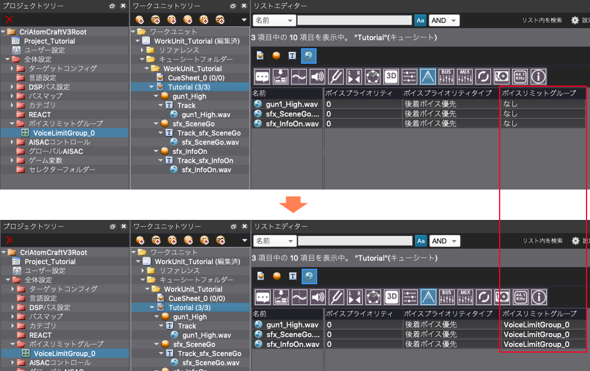

## Robot教程篇 Part 11：来尝试使用find_object吧（下）
到目前为止，我们已经介绍了各种操作CRI AtomCraft的函数，但所有这些都是在一次调用中获得一个对象的函数。<br/>
find_objects函数是一个非常有用的函数，它允许我们在一次调用中获取多个对象。<br/>
本教程将介绍如何使用find_objects函数一次检索多个对象。

让我们写一个脚本，为一个工作单元中的所有波形区域批量设置Voice限数组。

本教程将使用在教程<a href="../Ch-2-Project-Module/Atom_Craft_Robot_Part_06.md" target="_blank">“创建一个项目并注册波形文件”</a>中创建的项目。

### 准备脚本文件
在脚本菜单中，选择“脚本列表”。<br/>
在脚本列表窗口中按下 "新建 "按钮，创建一个脚本文件，名称如下：

| 脚本保存地址     | 脚本文件名                                |
|:-----------------|:------------------------------------------|
| tutorials [CRI]  | tutorial05-2_use_find_object.py           |

### 脚本文件说明
双击刚刚创建的脚本，在脚本编辑器中打开它，并写上如下的描述语句：

```python
# --Description:[教程]使用find_object函数&批量设置波形区域的Voice限数组
```

### 导入模块
接下来我们导入以下模块：

```python
import sys
import cri.atomcraft.debug as acdebug
import cri.atomcraft.project as acproject
```

导入用于项目操作的project模块，以及用于日志输出的debug模块。

### 获取要设置的Voice限数组
我们先获取要为波形区域设置的Voice限数组。
要获得Voice限数组，可以使用以下函数，方法与 <a href="../Ch-4-Build_Binary/Atom_Craft_Robot_Part_08.md" target="_blank">“游戏数据（ACF，ACB）的输出”</a>教程中获得目标配置相同。

| 函数名            | 说明                |
|:------------------|:--------------------|
| get_global_folder | 获取选择器文件夹等总体设置下方的文件夹 |
| get_child_object  | 搜索并获取指定的父对象正下方的对象 |

使用这些函数来获取Voice限数组的脚本如下所示：

```python
# 获取Voice限数组文件夹
voicelimit_group_folder  = acproject.get_global_folder("VoiceLimitGroupFolder")["data"]

# 获取Voice限数组“VoiceLimitGroup_0”
voicelimit_group = acproject.get_child_object(voicelimit_group_folder, "VoiceLimitGroup", "VoiceLimitGroup_0")["data"]
```

管理同时发声数量的Voice限数组可以使用get_global_folder函数从全局设置中的Voice限数组文件夹中获得。
在得到Voice限数组文件夹后，我们使用get_child_object获取Voice限数组文件夹下的Voice限数组“VoiceLimitGroup_0”，并将其存储在变量voicelimit_group中。

### 获取设置Voice限数组的波形区域
以下函数可以用来检索工作单元下的所有波形区域：

| 函数名       | 说明                  |
|:-------------|:----------------------|
| get_workunit | 获取工作单元          |
| find_objects | 以递归方式搜索对象并获取所有符合条件的对象 |

使用这些函数检索波形区域的脚本如下所示：

```python
# 获取工作单元
workunit = acproject.get_workunit("WorkUnit_Tutorial")["data"]

# 使用find_objects来获得CueSheet中的波形区域列表
waveformRegions = acproject.find_objects(workunit, "WaveformRegion")["data"]
```

#### 说明
find_objects函数可以用于以列表形式检索一个工作单元下的所有波形区域。
该函数需要指定“作为搜索根的对象”和“要检索的对象类型”。
由于我们要检索工作单元下面的所有波形区域，我们指定工作单元变量 “WaveformRegion”（波形区域类型的名称）并将检索到的列表存储在waveformRegions变量中。

### 为每个波形区域设置Voice限数组
从先前获取到的波形区域列表中一次取出一个波形区域，并设置Voice限数组。
要从波形区域列表中获取波形区域，请使用for语句。

```python
# 用for循环从波形区域列表中逐一获取波形区域
for region in waveformRegions:
    # 在波形区域设置Voice限数组
    acproject.set_value(region, "VoiceLimitGroup", voicelimit_group)

acdebug.log("[教程]使用find_objects函数&波形区域设置Voice限数组运行完毕")
```

### 脚本的保存与运行
脚本的编写到此结束。<br/>
保存并运行该脚本，如果脚本运行成功，工作单元内的全部波形区域的Voice限数组都会被设置为“VoiceLimitGroup_0”。


