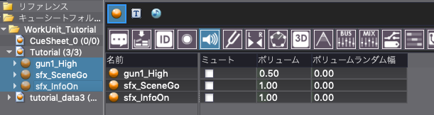

## Robot教程篇 Part 13：使用get_selected_objects函数

在前面的教程中，我们已经介绍了如何使用脚本来获得一个对象，并对其进行各种操作。
在CRI Atom Craft Robot中，我们也可以通过GUI获取选定的对象，并使用脚本对其进行操作。
在本教程中，我们将创建一个脚本，使用get_selected_objects函数来获取当前在GUI中选中的Cue，并改变它们的音量。



本教程将会使用之前在<a href="https://game.criware.jp/learn/tutorial/atomcraft/atomcraft_robot_10/" target="_blank">“让我们使用find_object函数”（日文）</a>教程中创建的工程。

### 选中Cue
在本教程中，我们将对GUI中当前选定的对象进行操作，因此我们先在CRI Atom Craft的GUI中选中Cue。
选择CueSheet“Tutorial”中的所有Cue，如下图所示。


### 准备脚本文件
在脚本菜单中，选择“脚本列表”，此时会出现一个脚本列表窗口，我们可以从中选择将要运行的脚本。
在脚本列表窗口中按下”新建“按钮，创建一个脚本文件，名称如下：

| 脚本保存地址    | 脚本文件名                               |
|:----------------|:-----------------------------------------|
| tutorials [CRI] | tutorial05-4_use_get_selected_objects.py |

### 脚本文件说明
双击创建的脚本，在脚本编辑器中打开它。
为了能够在“脚本列表”的窗口中显示脚本的内容，我们应当写一个脚本的描述，如下所示：
```python
# --Description:[教程]检索当前选中的Cue，并批量改变它们的音量
```

### 导入模块
完成脚本描述之后，请导入以下模块，以便在你的脚本中操作CRI AtomCraft。
```python
import cri.atomcraft.debug as acdebug
import cri.atomcraft.project as acproject
```

导入用于工程操作的project模块和用于日志输出的debug模块。

### 获取选中的Cue
project模块提供了以下函数，以检索GUI中的选定对象：

| 函数名               | 说明             |
|:---------------------|:-----------------|
| get_selected_objects | 获取GUI于树状列表中选中的对象 |

可以编写脚本来获取在GUI中的当前所选对象，如下所示：
```python
# 获取选中的Cue
selected_cues = acproject.get_selected_objects("Cue")["data"]
```

#### 说明
函数get_selected_objects中会指定“对象类型名称”。
当我们调用该函数时，只能获取GUI中选中的和指定类型一致的对象，结果将以列表的形式展现。
在这里，为了获取选中的Cue，我们指定“Cue”作为对象类型，并得到一个包含Cue的列表。

### 更新获取到的Cue的值
获取当前列表里的Cue的音量，并让它们增加0.5。
要获取和设置一个Cue的音量值，请使用以下函数：

| 函数名     | 说明            |
|:-----------|:----------------|
| get_value  | 获取对象的参数  |
| set_value  | 设置对象的参数  |

我们可以在脚本中使用这些函数，在当前音量上增加0.5，如下所示：
```python
# 获取Cue的当前音量值，并设置一个新的音量
for cue in selected_cues:
    # 取得Cue的音量
    val = acproject.get_value(cue, "Volume")["data"]
    volume = float(val)
    # 将音量设定为增加了0.5之后的新值
    acproject.set_value(cue, "Volume", volume + 0.5)

acdebug.log("音量变更完毕")
```
通过get_value获得的值是一个string（与参数无关）。
因此，我们使用float函数将其从string变为float。

### 脚本的保存与运行
脚本的编写到此结束。
保存并运行该脚本，如果脚本运行成功，所有选定的Cue的音量将增加0.5。


