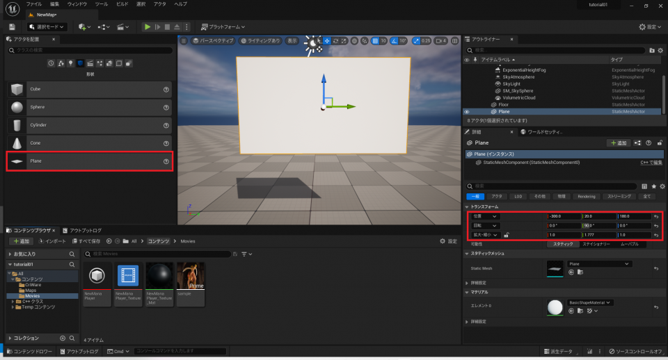
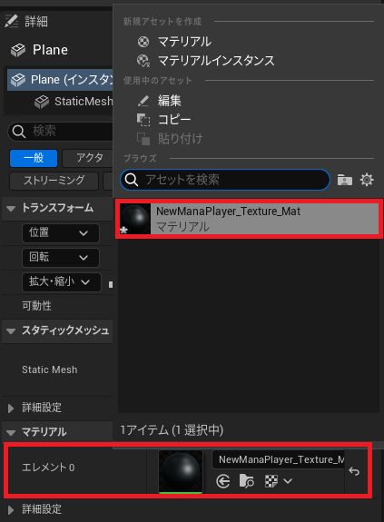

## 入门篇01 Sofdec视频的简单播放

### 简介
关于CRI的UE4插件的基本知识和UE4插件的介绍，请参考以下内容：
* [CRI ADX2（Unreal Engine4）准备篇00](../ADX%20UE%20Tutorial/Ch-0-Preparation/ADX-UE-00.md)
* [CRI ADX2（Unreal Engine4）入门篇01](../ADX%20UE%20Tutorial/Ch-1-Play-a-Sound/ADX-UE-01.md)

### 关于Sofdec视频的编码方法
Sofdec是一个多平台对应、高画质高音质的视频播放系统。

CRIWARE SDK for UE4为UE4项目提供Sofdec功能。

Sofdec处理专门的视频数据（Sofdec视频），用于虚幻引擎4的CRIWARE SDK包含了用于编码Sofdec视频的 “Sofdec Encoding Wizard”工具。它位于以下文件夹中：
* /cri/tools/Sofdec2/

使用Sofdec Encoding Wizard对Sofdec视频进行编码时，请选择以下设置：
* 平台：Standard
* 视频编解码器：Sofdec.Prime或h.264或vp9

### 创建、放置和播放视频纹理
Sofdec可以将视频作为纹理在游戏场景中放置和绘制。 此外，有专门的API允许灵活地检索、连锁播放、控制等。

首先，作为最简单的方法，我们将解释如何将视频纹理添加到关卡中的StaticMesh上进行简单的播放。

具体步骤如下。

#### (1) 导入Sofdec文件并创建ManaMovie资产
在Windows中，将Sofdec文件从资源管理器拖入内容浏览器。

这将把Sofdec文件作为ManaMovie资产导入。

“Mana”是指Sofdec系统中最基本的核心运行模块的名称；可以理解为Sofdec是指包括了编码工具的整个系统，而Mana是指Sofdec中包含的运行库。

从添加内容中选择“Sofdec2”->“Mana Player”。

勾选“Video output ManaTexture asset”并点击“OK”。

这将同时创建一个“Mana Texture”。

双击在内容浏览器中创建的“Mana Player”。

在出现的窗口中，选中“Play on Open”。

此外，在“Mana Texture”中选择Sofdec视频显示用的纹理。

接下来，双击“Mana Texture”。在出现的窗口中，在“Movie Source”栏中选择Sofdec视频显示用的纹理。

从生成好的纹理的右键菜单中点击“Create Material”。

注意：将上面的“Mana Texture”中的“Movie Source”设置完毕后再创建材料。

如下图所示，系统会提示你选择材料类型。

“component textures”的材料将使用视频的各个颜色成分（YUV(A)）作为材料的来源。
YUV到RGB的转换是在这个材料中进行的。出于性能考虑，我们推荐这样做。

“Render to Texture”的材料将使用屏幕外的、预渲染的YUV到RGB纹理（RGB）。
指定这个选项会自动启用ManaTexture中的“Render to Texture”；当需要使用RGBA纹理时，推荐用这个选项。

。

目前为止，我们已经创建了以下三种类型的资产：

(a) ManaMovie资产：持有Sofdec文件的路径和属性信息的资产，但不包含Sofdec视频数据本身。 
(b) ManaPlayer资产：控制Sofdec视频播放的资产。 
(c) ManaTexture资产：用于显示Sofdec视频的纹理。 
(d) 材料：用于绘制Sofdec视频的材料。

#### (2) 将视频附在关卡上的StaticMesh上并播放
接下来，准备一个用于放置ManaTexture资产的StaticMesh。在这个例子中，我们将使用一个平面（Plane）。

将长宽设置为16:9的比例。（位置仅作参考。任何能在屏幕上看到视频的位置都行）
* 位置: (-300.0, 20.0, 180.0)
* 旋转: (810.0, 360.0, 90.0)
* 比例:（1.777，1.0，1.0）

在“Materials”>“元素0”下的面板中选择一个Sofdec视频用的材料。

接下来，打开“关卡蓝图”。

添加以下变量：
* ManaPlayer（见ManaPlayer对象）：播放视频的Mana播放器。

接下来，创建一个在游戏开始时播放的蓝图。

如下图所示。在Set Texture中为In Mana Texture选择一个用于Sofdec视频显示的纹理。

此外，添加“Open Movie Source”，并在“In Mana Movie”中选择要播放的Sofdec文件的“ManaMovie asset”。

编译一下蓝图。

接下来，选择“Mana Player”，打开详细面板。

在“默认值”下，为“Mana Player”选择控制Sofdec视频播放的资产。

编译并再次保存该文件。

### 停止并从头播放视频
Sofdec允许停止并从头开始播放视频。

让我们创建一个通过按键盘上的P来停止/从头播放视频的蓝图，如下图所示。

注意：使用“Close”节点来停止视频，使用“Open Movie Source”节点来播放视频。

ManaPlayer的“Play”节点可以省略，用于视频播放。

在这种情况下，在内容浏览器中双击“ManaPlayer”并勾选“Play on Open”。

### 暂停和继续播放视频
Sofdec允许暂停并继续播放视频。

按键盘上的P键，暂停/继续播放视频。

关卡蓝图的配置如下所示。

注意：使用“Pause”节点来暂停视频，使用“Play”节点直接从视频的暂停处继续播放。

### 在视频之间进行切换
让我们创建一个在两个或多个具有相同分辨率的视频之间切换的功能。
添加以下变量。在添加变量后编译一次。
* MovieList（ManaMovie对象的引用数组）：要切换的“视频源”的列表。
* Index（整数）：正在播放的列表的索引。

在“默认值->Movie List”中按下“+”，向MovieList变量添加元素。
（在图片中，添加了“sample1”和“sample2”的“Movie Source”）。

蓝图如下所示：

“更新Index”如下图所示：

Index变量的值加一，如果它超出了范围，那么它的值就被设置为0。
