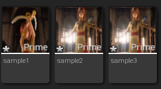

## 入门篇02 如何连续播放多个Sofdec视频

本节将介绍如何按顺序播放多个Sofdec视频。

要按顺序播放多个Sofdec视频，请使用“播放列表”和“无缝播放”功能。

### 关于播放列表
连续播放多个Sofdec视频的功能被称为“播放列表”功能。下面我们将解释播放列表的功能。

#### 播放列表的使用方法
现在我们介绍如何播放与某一关卡的StaticMesh相连的播放列表。具体步骤如下。

**创建一个播放列表和相关资产**

将Sofdec文件从资源管理器中拖放到内容浏览器中。

此操作将Sofdec文件作为ManaMovie资产导入。

所有的视频都通过这个操作导入到播放列表。

在内容浏览器中，选择所有的视频资产，右击其中一个选定的资产，从菜单中选择“Create ManaPlaylist”。

如果有必要，双击播放列表来编辑视频的顺序。

接下来，创建“Mana Player”、“Mana Texture”和“Mana Material”。

可以回顾[“CRI Sofdec入门篇01”](SOF-UE-01.md)的内容。在此基础上，让我们用“ManaPlaylist”替换“Mana Movie”资产。

最终结果如果是这样的，就成功了。

接下来，编辑关卡蓝图。

也可以回顾[“CRI Sofdec入门篇01”](SOF-UE-01.md)的内容。注意从“Open Movie Source”到“Open Playlist”的变化。

