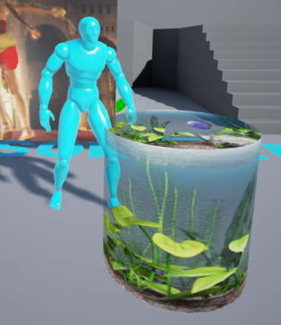
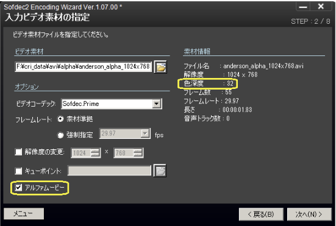
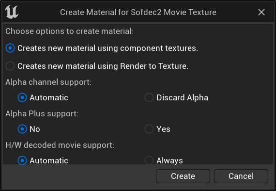
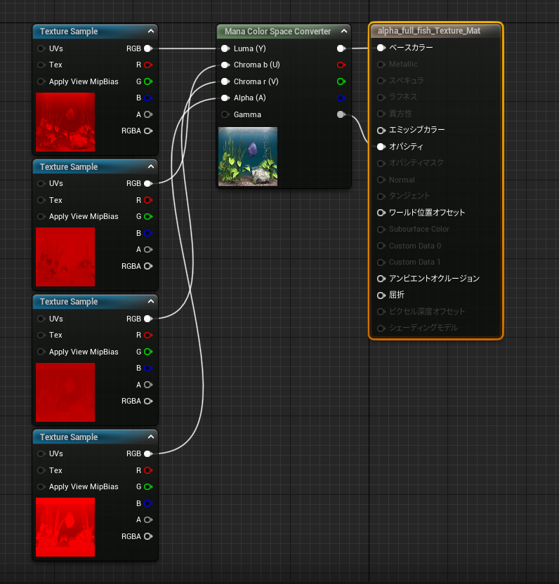
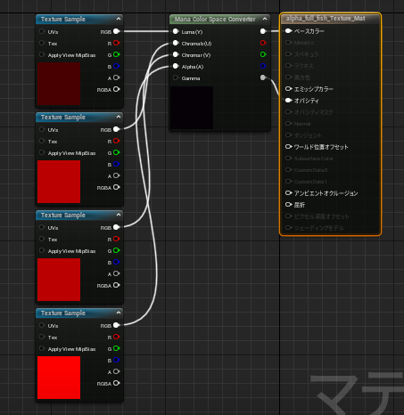
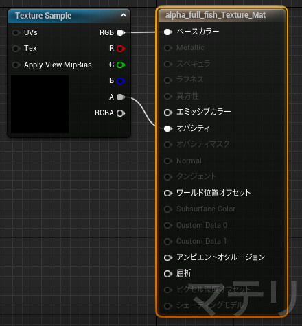
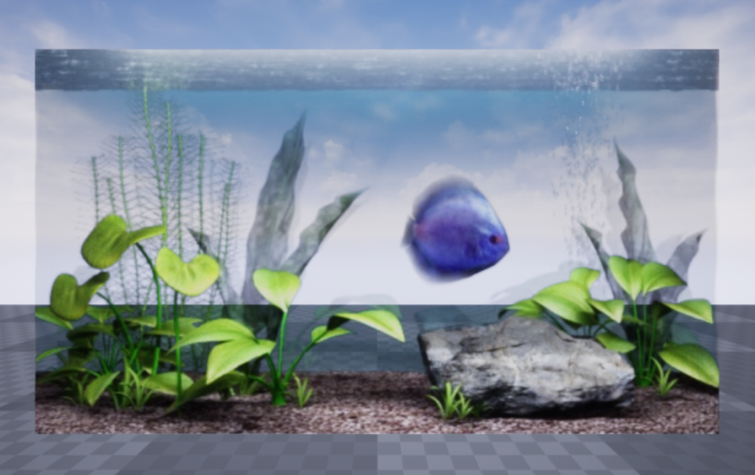

## 入门篇03：如何播放带有透明度信息的Sofdec视频
带有透明度信息的Sofdec视频被称为“Sofdec alpha视频”或简称“alpha视频”。
在本章中，我们将介绍如何回放一个alpha视频。

### Alpha视频
Alpha视频有每个视频帧的透明度信息（透明度值、Alpha值和Alpha通道）。

透明度信息与普通帧一起被解码为Sofdec视频数据。

通过在材料中输入和使用这些值，可以播放和显示透明背景的视频，如下图所示。

#### Alpha视频的制作方法
它的基本原理和[“CRI Sofdec入门篇01”](SOF-UE-01.md)中介绍的Sofdec影片编码方法相同。

要制作Alpha视频，我们必须准备包含8位Alpha通道信息的32位视频素材数据。启动“Sofdec2 Encoding Wizard”，在“指定输入视频素材”页面指定一个带有Alpha通道的视频文件。

指定文件后，检查“Alpha视频”复选框。确保此时颜色深度被设置为32位作为材料信息。

在设置输出目的地和其他编码参数后，进行编码以创建Alpha视频数据。

#### 如何播放Alpha视频
本节介绍了如何将Alpha视频放置到StaticMesh中进行播放。

步骤基本上与[“CRI Sofdec入门篇01”](SOF-UE-01.md)相同，具体步骤如下。
1. 将一个以Sofdec USM文件格式编码的Alpha影片从资源管理器拖入内容浏览器。
2. 在生成的资产的右键菜单中点击Create ManaTexture。
3. 从生成纹理的右键菜单中点击创建材料。
4. 你将被提示选择一个材料类型。确保“Alpha Channel Support”被设置为“Automatic”。

如果选择了Compoment Textures，就会输出以下材料。

如果你看到如下图所示的黑色图像，请参考[“CRI Sofdec入门篇01”](SOF-UE-01.md)进行播放。

之后，当视频加载完毕时，与视频一致的图像会显示在框中。

如果选择了“Render to Texture”， 就会输出以下的材料。

之后的步骤与[“CRI Sofdec入门篇01”](SOF-UE-01.md)相同。

