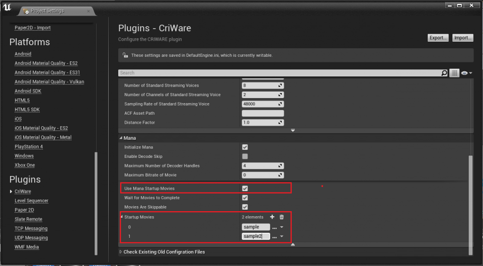

## 入门篇04：游戏开始后立即播放视频
本节将介绍如何使用Mana Startup Movie功能，在游戏开始的同时播放Sofdec视频（Sofdec专用视频数据）。

### 创建一个Sofdec视频
CRIWARE SDK for Unreal Engine包括一个用于创建Sofdec视频文件（扩展名为.usm）的编码工具，其文件夹如下：
* /cri/tools/Sofdec2/

使用Sofdec2 Encoding Wizard进行编码时，请使用以下设置：
* 平台：Standard
* 视频编解码器：Sofdec.Prime或h.264或vp9

有关工具使用方法的详细信息，请参考CRI Sofdec2工具用户手册。

### Mana Startup Movie功能
Mana Startup Movie功能使用户感觉不到在游戏过程中出现的初始加载，从而确保了愉快的游戏体验。

#### Mana Startup Movie的使用方法
下面将介绍Mana Startup Movie功能的初始设置和使用。 
为了在游戏开始时播放Sofdec视频，必须在项目设置中启用“Mana Startup Movie”。 
以下是设置的步骤。

1. 打开项目设置窗口。
2. 在插件部分选择CriWare设置。
3. 在CriWare设置的Mana部分，打开标有Advanced Option的项目。
4. 启用“Enable Mana Startup Movies”。
5. 在“Startup Movies”列表中添加想要播放的USM视频文件。

### Mana Startup Movie功能的详细介绍
**Use Mana Statup Movies**  
使用Sofdec视频而不是UE标准视频。

**Wait for Movies to Complete** 
即使游戏已经加载完毕也会等待处理，直到视频播放完毕。

**Movies are Skippable** 
当给出用户控制器或其他输入时，可以跳过视频。

**Startup Movies** 
存储游戏启动时要播放的视频文件的名称。 
请注意，要播放的视频文件必须包含在Game/Content/Movies目录中。

#### 注意
UE对影片大小和帧率有限制，但启动视频要遵守CriWare插件所支持的USM影片设置。 
当使用Alpha视频时，背景是黑色的。