## 入门篇05：全屏播放&在UI中播放视频

本节将告诉你如何在全屏和UI下播放Sofdec视频。

### 以全屏播放视频
使用UMG（Unreal Motion Graphics），一个覆盖整个屏幕的图像可以被添加到UI层。
具体步骤如下。

#### 1.导入一个Sofdec视频并准备Mana资产
按照[“CRI Sofdec入门篇01”](SOF-UE-01.md)中的步骤将一个需要全屏播放的视频导入虚幻引擎。

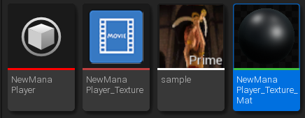

在编辑材料中，选择材料的“Result Node”。 
在细节面板中，将“Material Domain”改为“User Interface”。 
这将使“视频材料”在UMG组件中可以使用。

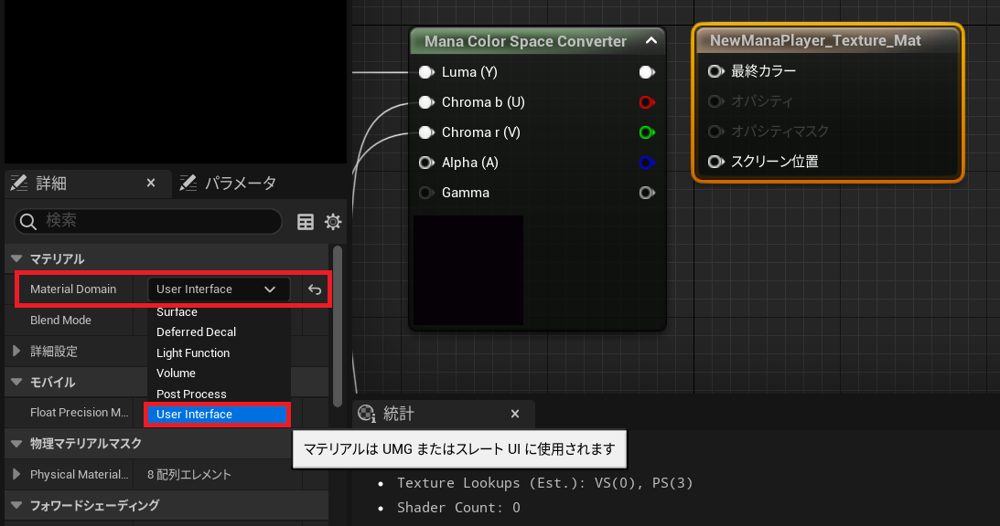

注意：ManaColourSpaceConverter的输出必须重新链接到结果节点的Final color（如果使用Alpha视频的话，也需要链接不透明度）。

#### 2.在场景中添加一个新的UserWidget蓝图
在内容浏览器中创建一个新的蓝图类。

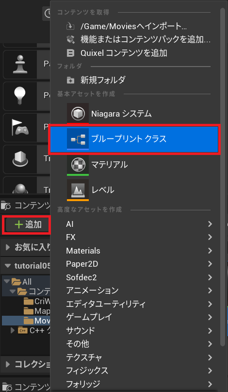

展开“所有类”并选择“Visual/Widget/UserWidget”。

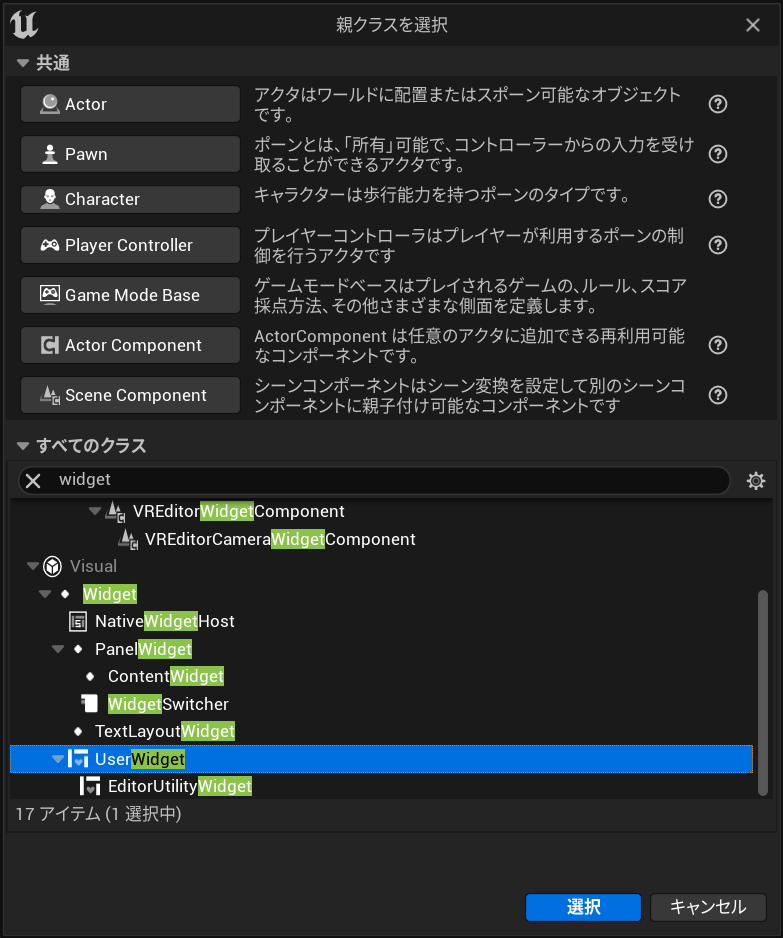

将创建的资产命名为“FullScreenWidget”。

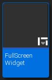

#### 3.编辑组件
在“调色板”面板中找到“Image”组件，并将其拖放到设计器中。

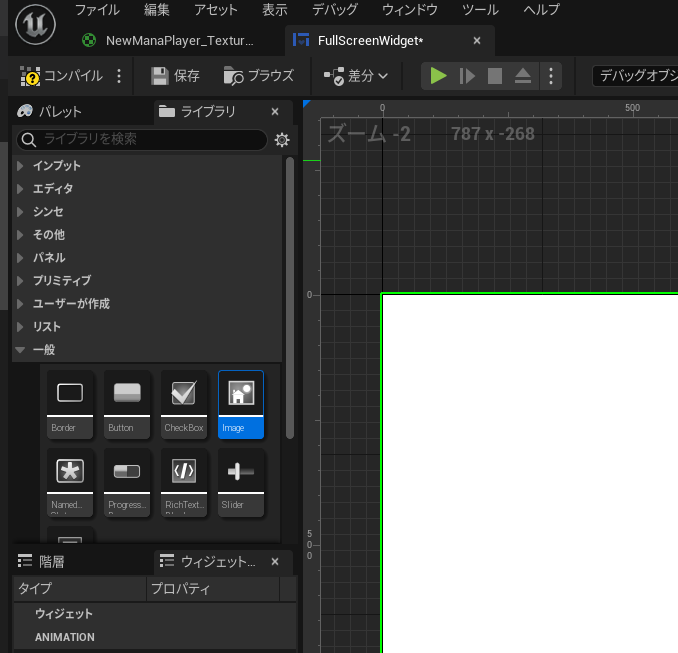

在设计器中选择Image组件，在详细面板中展开“Appearance/Brush”，并在“Image”栏中设置视频素材。

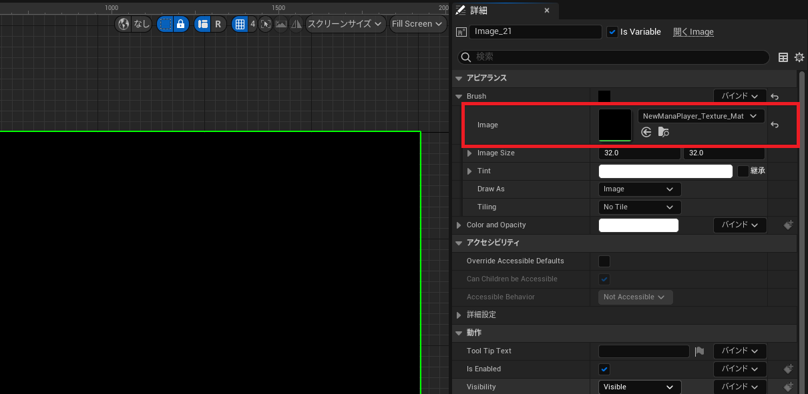

#### 4.编辑关卡蓝图
打开关卡蓝图。（“蓝图”按钮->“打开关卡蓝图...”）。 
添加如下所示的蓝图代码。

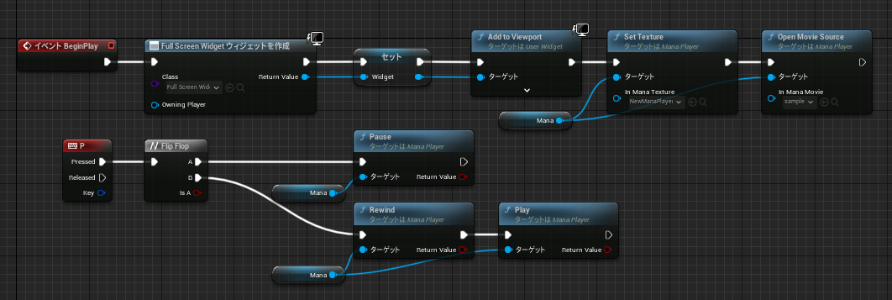

可以从这里复制蓝图代码：<a href="https://blueprintue.com/blueprint/8zvvholj/" target="_blank">https://blueprintue.com/blueprint/8zvvholj/</a>

创建两个变量。

| 对象类型                          | 描述                           |
|-----------------------------------|--------------------------------|
| Mana（参考Mana Player对象）       | 拥有用于播放视频的Mana播放器。 |
| Widget（参考FullScreenWidget对象）| 拥有显示视频的组件。           |

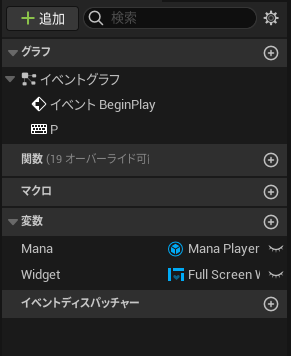

在“Mana Player”节点的详细面板中配置“Mana”。

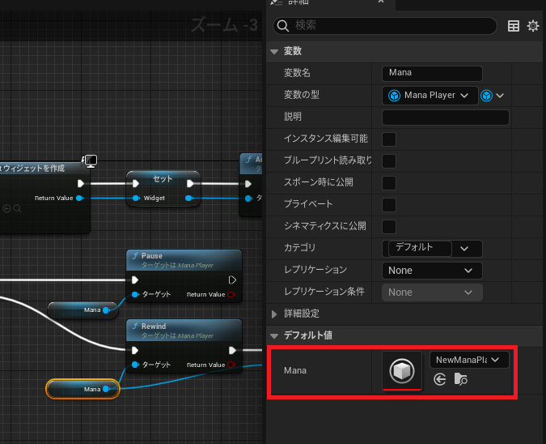

在“Set Texture”节点中设置“In Mana Texture”。 
在“Open Movie Source”节点中设置“In Mana Movie”。

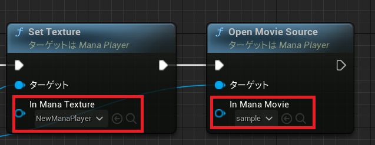

当视频播放结束时，“OnEndReached”事件被触发，此时FullScreenWidget被隐藏。

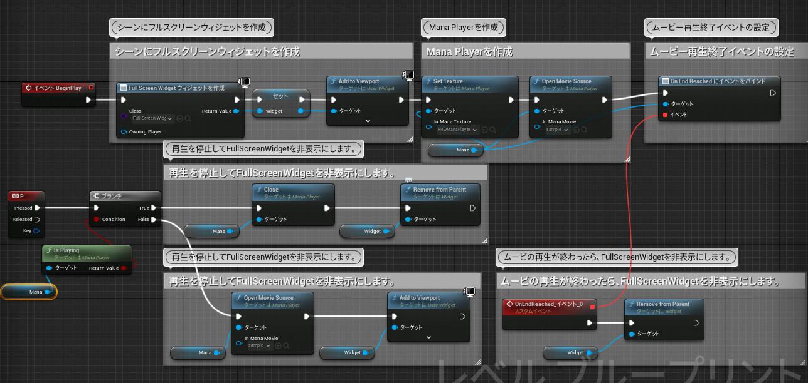

该蓝图还增加了以下新的变量：
* Is Playing（Boolean）：保持播放状态。

### 在UI中播放视频
可以按照上述“全屏播放视频”的程序来创建一个用户界面。 
之后可以在UMG中添加必要的UI对象并链接动作。 
下面是一个带有播放和停止按钮的UI的例子。

#### 如何在UI中播放视频
在UI上添加一个按钮。

**组件设计器** 
在蓝图中，为“Mana Player”引用添加一个变量，并为点击按钮时的事件添加代码。
“Stop”按钮调用Mana Pause，“Play”按钮调用Mana ReWind。
在内容浏览器中，选择“添加”->“用户界面”->“组件蓝图”。

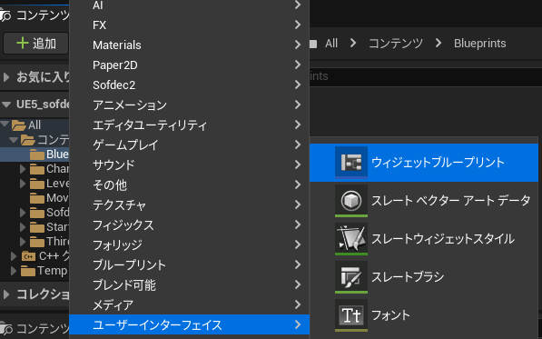

命名为“UiPlayerWidget”。

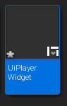

将“面板”->“Canvas Panel”拖放到画面中。

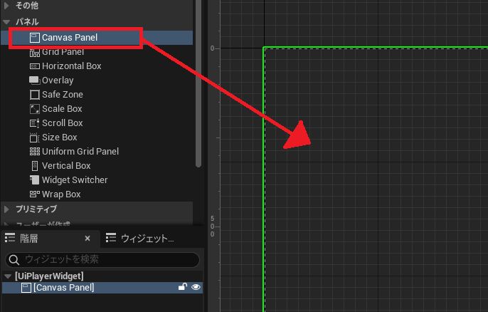

然后是“常用”->“Image”。

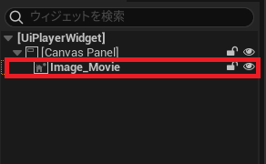

同样地，拖放“常用”->“Button”到画面中。 
这次我们将有两个按钮，“Stop”和“Play”，控制视频的播放和停止。

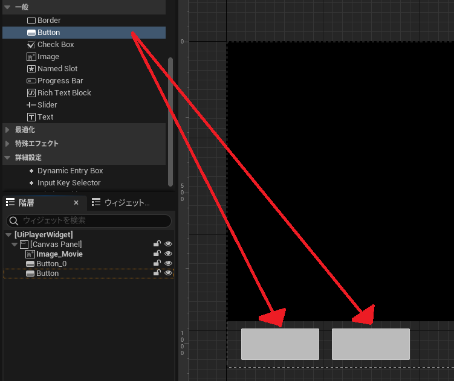

接下来，给按钮添加文本。
将“常用”->“文本”拖到放置的按钮上。

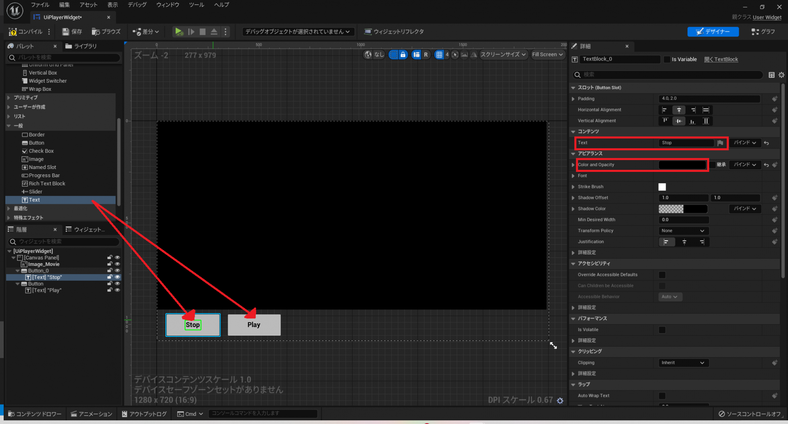

接下来，将层级中的“Button”重新命名。名称可以是“Stop”或“Play”，只要你知道它是哪个按钮。 
(在这种情况下，我们使用“Button_Stop”和“Button_Play”）。

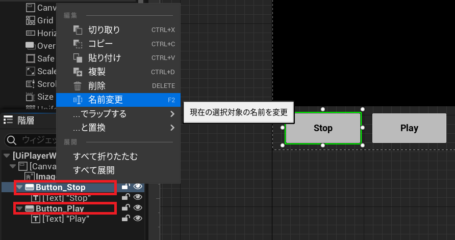

设置控制模式，使用户能够控制UI。 
在当前打开的“组件设计器”的右上角选择“图表”。

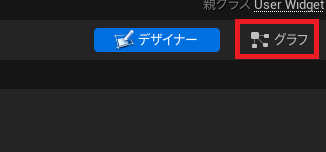

**关卡蓝图** 
可以从这里复制蓝图代码：
<a href="https://blueprintue.com/blueprint/j_bfoawd/" target="_blank">https://blueprintue.com/blueprint/j_bfoawd/</a>

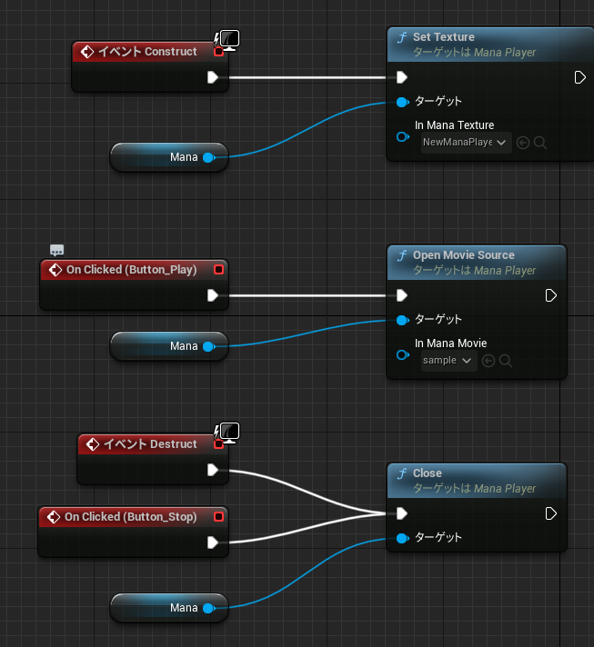

### 虚幻引擎手册参考
关于UMG和actor组件的更多信息，请参考虚幻引擎文档：
* UMG：<a href="https://docs.unrealengine.com/5.0/zh-CN/umg-ui-designer-for-unreal-engine/" target="_blank">https://docs.unrealengine.com/5.0/zh-CN/umg-ui-designer-for-unreal-engine/</a>
* Actor Component：<a href="https://docs.unrealengine.com/5.0/zh-CN/components-in-unreal-engine/" target="_blank">https://docs.unrealengine.com/5.0/zh-CN/components-in-unreal-engine/</a>
