## 入门篇06：播放带字幕的视频
本节将介绍如何播放带有字幕的Sofdec视频。

### 播放带有字幕的视频
可以把视频附在关卡中的一个物体上播放，如下图所示。 
具体步骤如下。

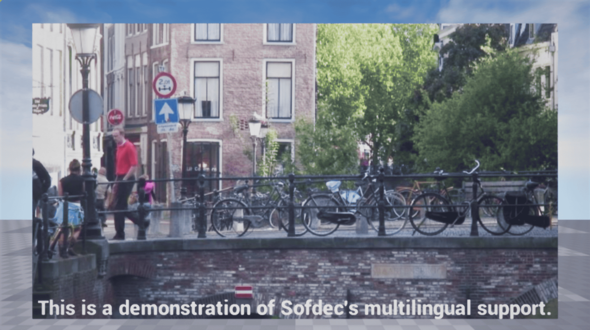

#### 1.导入sofdec视频并准备Mana资产
按照[“CRI Sofdec入门篇01”](SOF-UE-01.md)中的说明，将视频导入虚幻引擎中进行字幕制作。

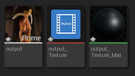

#### 2.将视频附在关卡中的一个平面上，并将其播放出来
创建一个StaticMesh来容纳ManaTexture。这次我们使用了一个平面。 
将其设置在可见位置上，比例为16:9。
* 位置: (100.0, 0.0, 110.0)
* 旋转: (90.0, 0.0, 90.0)
* 放大/缩小: (1.777, 1.0, 1.0)

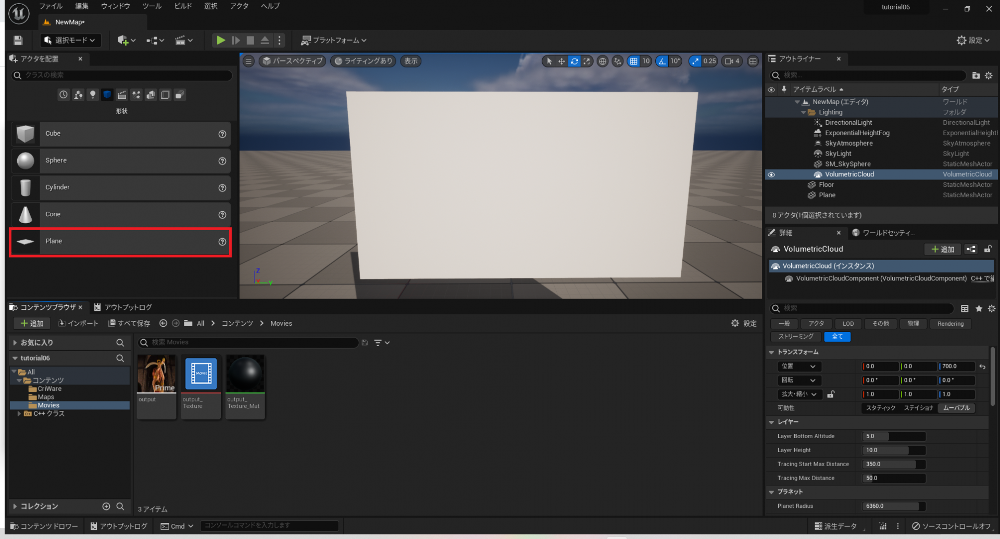

在名为“Plane”的Actor的详细面板上点击“添加蓝图/脚本”。

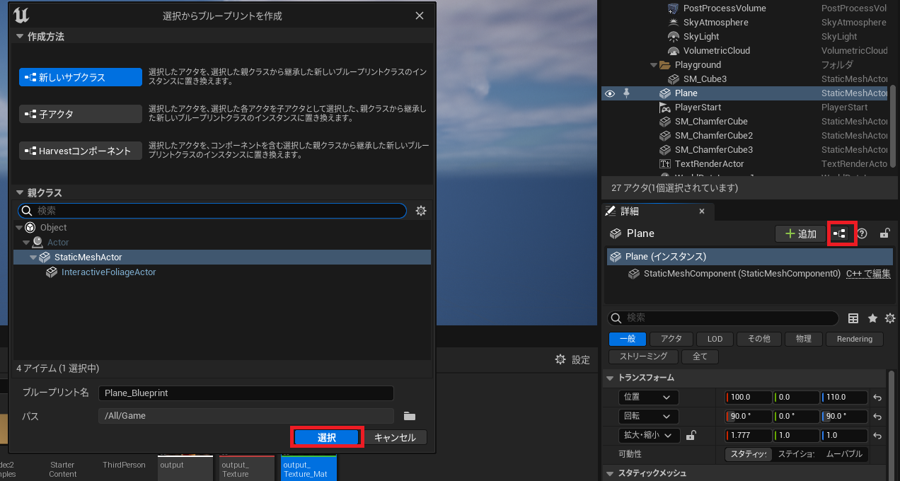

打开创建的蓝图，在“StaticMeshComponent”详细面板中把视频材料设置为“Materials > Element 0”。

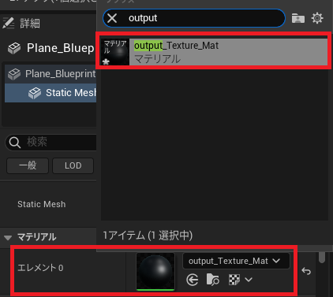

从“添加组件”的下拉列表中，选择“Mana Component”。

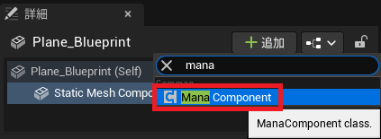

在Mana Component的详细面板中将视频纹理设置为“Rendering > Movie”。

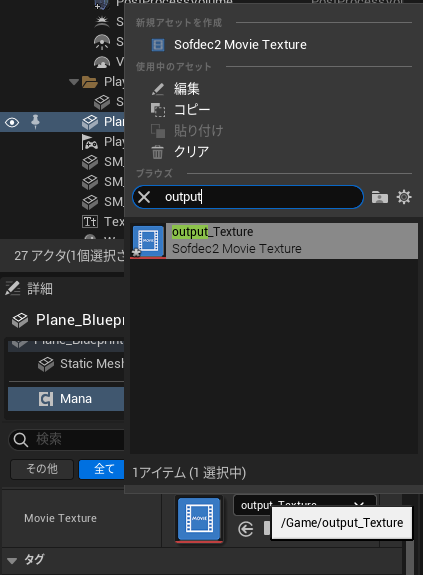

创建一个蓝图图表，在游戏开始时开始播放，如下图所示。 
通过上述操作，视频就在平面上播放了。

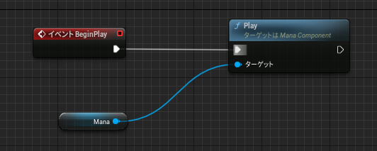

#### 3.在视频播放中添加字幕
从“添加组件”下拉列表中，选择“TextRender”。

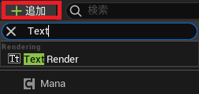

将TextRender放在视口中，使其在平面上可见。

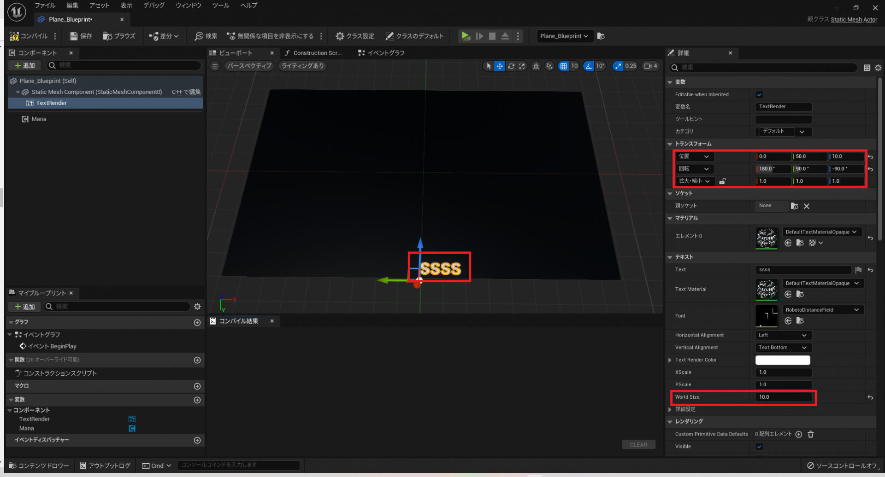

在Component列表中选择Mana。

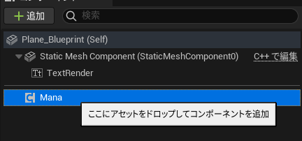

要用字幕播放视频，请在Mana详细面板中编辑“Subtitle”部分。
* 通过打开“Subtitles Enable”来激活字幕。
* 设置“Subtitles Channel”。
* 选择用于字幕通道的字符串编码“Subtitles Encoding”（默认为utf-8）。

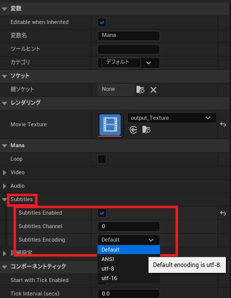

注册“OnSubtitlesChanged”事件。 
当事件被触发时，会获取新的字幕，并改变在TextRender中显示的文本。

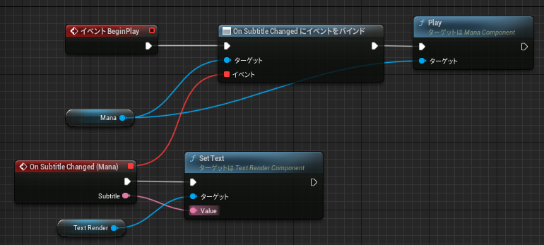

可以从这里复制蓝图代码：<a href="https://blueprintue.com/blueprint/wp821pfq/" target="_blank">https://blueprintue.com/blueprint/wp821pfq/</a>

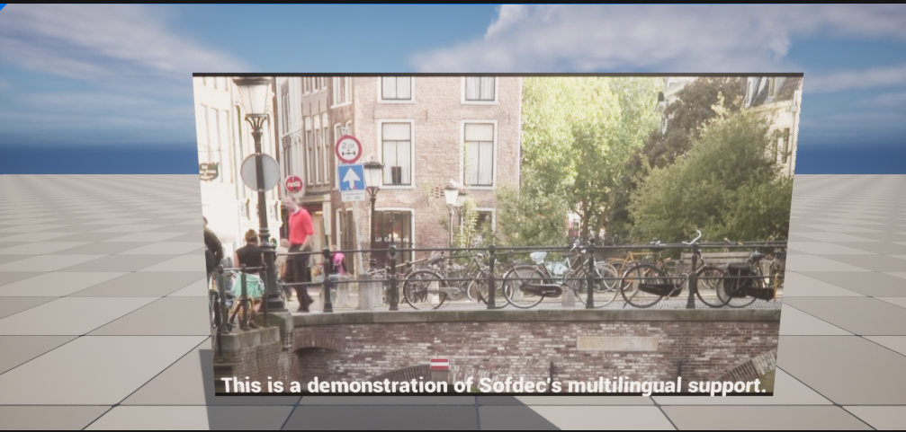

### 在游戏屏幕上显示视频字幕
UMG控件允许显示多行文字，使字幕更容易阅读。 
具体步骤如下。

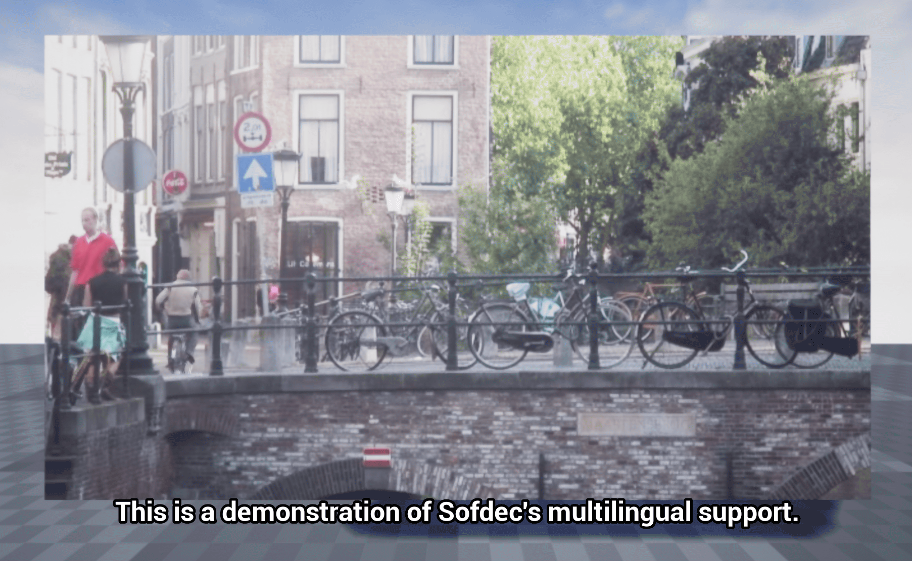

#### 1.在场景中添加一个新的UserWidget蓝图
在内容浏览器中创建一个新的蓝图类。

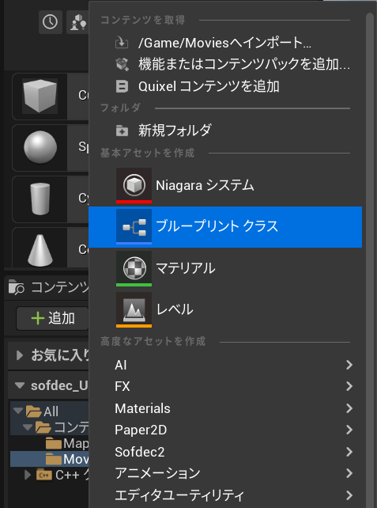

展开“所有类”并选择“Visual/Widget/UserWidget”。

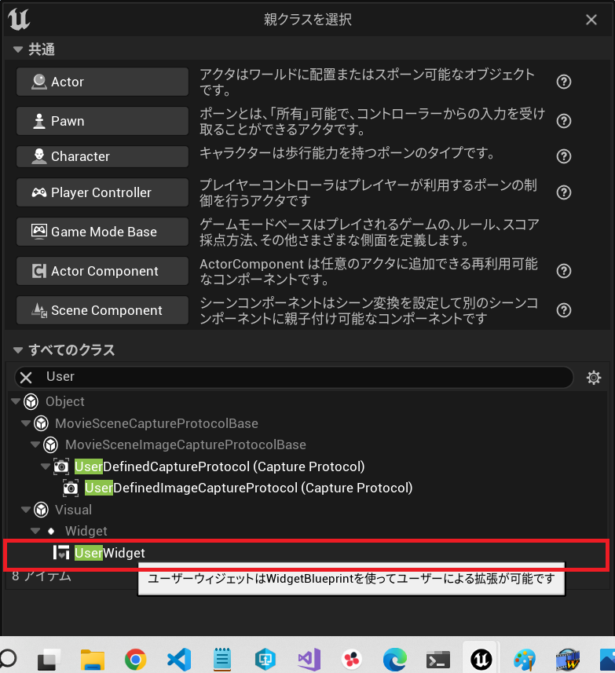

将资产重命名为“SubtitleWidget”。

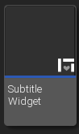

#### 2. 在控件设计器中添加一个文本块
在设计器中，在“面板”下添加一个“Canvas Panel”。

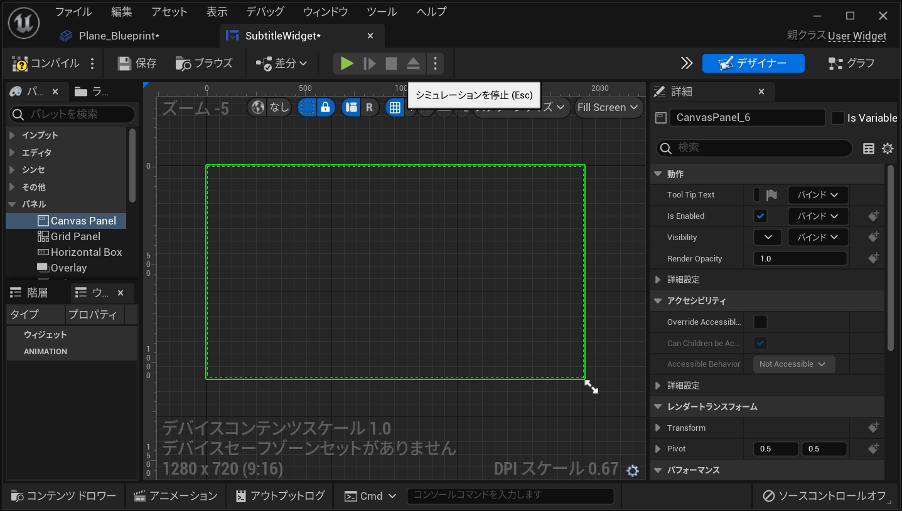

添加“常用” -> “文本”。 
将文本块放在画布上，并调整大小。 
要显示带有黑色轮廓的正式字幕，请调整文本块细节中的几个参数，如锚点、字体大小和“Outline Settings”（大小、颜色等）。 
要在多行上显示字幕，请激活“Auto Wrap Text”。 
同时，将文本部件设置为变量“Is Variable”，以使其他蓝图能够访问它。

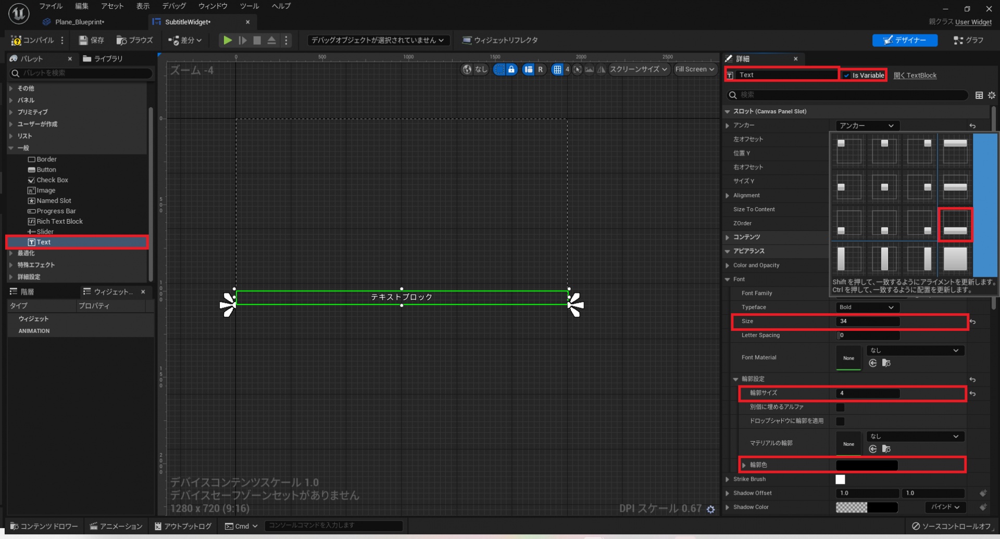

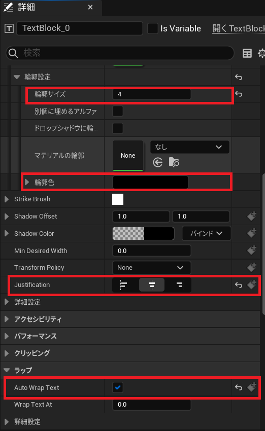

#### 3.更新蓝图
增加一个变量。
* Widget（参考SubtitleWidget对象）：拥有在屏幕上显示文本的控件。

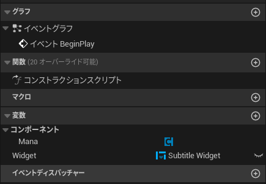

在上面创建的蓝图中，改变蓝图以将副标题文本发送到控件的文本块。

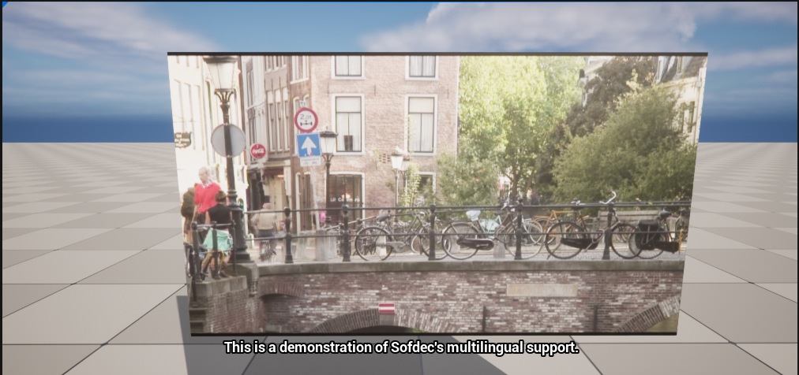

可以从这里复制蓝图代码：<a href="https://blueprintue.com/blueprint/tsyxnafa/" target="_blank">https://blueprintue.com/blueprint/tsyxnafa/</a>

结合[“CRI Sofdec入门篇05”](SOF-UE-05.md)，可以在UI中播放带字幕的全屏视频。

### 虚幻引擎手册参考
* Actor Component：<a href="https://docs.unrealengine.com/5.0/zh-CN/components-in-unreal-engine/" target="_blank">https://docs.unrealengine.com/5.0/zh-CN/components-in-unreal-engine/</a>
* UMG：<a href="https://docs.unrealengine.com/5.0/zh-CN/umg-ui-designer-for-unreal-engine/" target="_blank">https://docs.unrealengine.com/5.0/zh-CN/umg-ui-designer-for-unreal-engine/</a>
* TextRender (API)：<a href="https://docs.unrealengine.com/5.0/en-US/BlueprintAPI/Rendering/Components/TextRender/" target="_blank">https://docs.unrealengine.com/5.0/en-US/BlueprintAPI/Rendering/Components/TextRender/</a>
