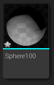
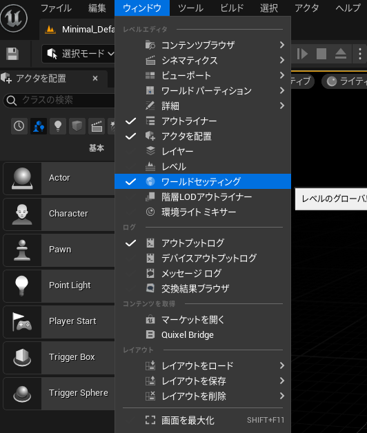

## 入门篇07：VR视频的播放方法
本节将介绍如何在UE4中播放VR视频。

### VR视频播放
如下图所示，可以将360°全景VR视频附到Sphere上播放。
具体步骤如下。

#### 1.导入Sofdec电影并准备Mana资产

#### 2.导入Sphere
虚幻引擎没有内置的具有球面坐标的原始球体。

你可以自行创建原始球体，但这次我们将使用一个由他人创建的“Sphere100.fbx”。 
模型可以在Github上下载： 
<a href="https://github.com/makoto-unity/PanoramaVideoWithUnity/blob/master/Assets/MyGame/Models/Sphere100.fbx" target="_blank">https://github.com/makoto-unity/PanoramaVideoWithUnity/blob/master/Assets/MyGame/Models/Sphere100.fbx</a>

把这个模型导入到虚幻引擎中。

去掉不必要的碰撞、材料、纹理等的导入。

#### 3.将视频粘贴到关卡中的球体上，然后播放
在关卡中放置球体资产，调整位置为原点（0,0,0），比例为（100,100,100）。

在Actor“Sphere100”的详细面板中，点击“添加蓝图/脚本”。

打开关卡蓝图。

接下来创建“Mana Player”。

一旦编译完成，从“ManaPlayer”的细节设置中选择“Mana Player”中创建的“ManaPlayer”。

编辑关卡蓝图，在游戏开始时播放视频，如下图所示。

改变材料，使照明反射不会发生。
* 打开视频材质，选择材质渲染节点，将“shading model”设置为“unlit”。
* 将“Mana Color Space Converter”节点的RGB输出链接到“Emissive Color”。

视频将在球体内部显示，因此需要将纹理坐标的UTilling反转。
* 在材料中添加一个“TextureCoordinate”节点。
* 将“TexCoord”节点链接到所有“TextureSample”节点。
* 在“TexCoord”细节面板中，将“UTiling”设置为“-1.0”。
* 也可以在“Mana Color Space Converter”节点的“Gamma”输入中调整视频的伽玛值。

#### 4.防止玩家移动到球体外
创建一个新的“GameMode”。

创建一个新的“Pawn”。

打开Pawn的蓝图，添加一个Pawn摄像机。

在世界设置（菜单中的“窗口” -> “世界设置”）中改变“GameMode”。

玩家将无法操控Pawn。

#### 5.运行
按下“VR预览”按钮来进行预览。

### 虚幻引擎手册参考
* Actor Component：<a href="https://docs.unrealengine.com/5.0/zh-CN/components-in-unreal-engine/" target="_blank">https://docs.unrealengine.com/5.0/zh-CN/components-in-unreal-engine/</a>
