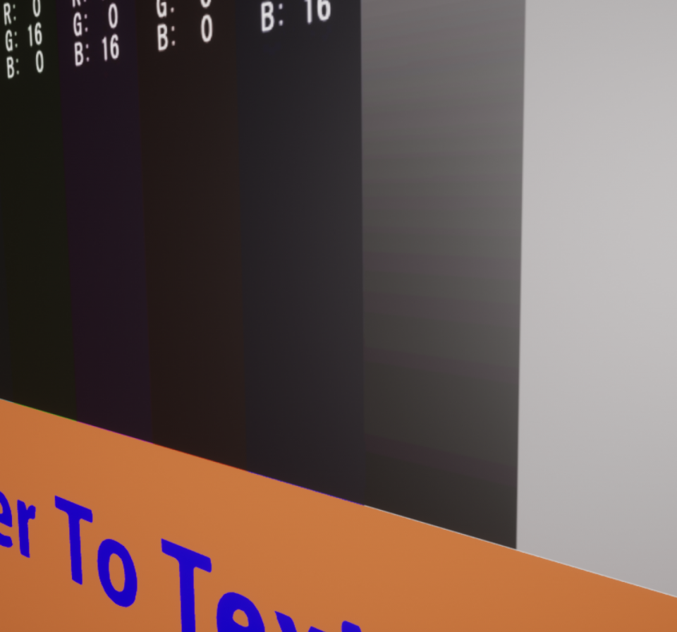

## 入门篇08：如何用色彩空间和伽玛校正设置来播放视频
本章将介绍如何通过色彩空间和伽玛设置来播放Sofdec视频。

### 播放带有色彩空间设定的视频
#### 色彩空间转换
虚幻引擎使用带有浮点数字的线性RGB色彩空间。 
这意味着在渲染场景时，无需伽马校正就能获得广范围的色彩。 
另一方面，为了改善视频压缩率，Sofdec视频使用了和虚幻引擎不同的YUV色彩空间（通常是Rec 601或Rec 709的8bit整数）编码。

由于格式和色彩空间的不同，CriWare插件将视频中使用的YUV颜色转换为虚幻引擎中使用的RGB颜色。

#### Sofdec视频的纹理: ManaTexture
ManaTexture是一个UTexture派生类，它持有称为“组件纹理”的子纹理。 
每个纹理都持有解码后的视频的一个子像素通道。

这个纹理类持有三个通道（Y,U,V）或两个通道（Y,UV）或只有一个通道（RGB）+ 用于Alpha视频的Alpha通道。

根据平台和视频格式（SofdecPrime、H264或VP9）的不同，组件纹理可能在内部反转，但UE4的UI和API中一定会有三个颜色通道（Y,U,V）。

##### 当使用具有组件纹理的素材时
转换应在蓝图中进行。 
材料函数“Mana Color Space Converter”可以达到这个目的。

蓝图材质总是使用三种纹理（Y,U,V），但着色器编译器可能会根据视频格式和平台自动生成不同数量的纹理样本。 
例如，因为iPhone上的H264视频解码器只输出Y和UV纹理（NV12格式），生成的素材也只有这两个纹理。

##### 如果在ManaTexture中勾选了“Render to Target”选项
YUV到RGB的转换是在屏幕外完成的，生成的像素被放置在ManaTexture的内部表面。 
因此，ManaTexture是一个可以作为经典纹理使用的RGBA纹理。

这种额外的离屏渲染可能会使用更多的内存和处理，因此不建议用于大型视频文件（4K、VR等），因为它可能会占用更多的内存和处理。

### 如何设置视频播放的色彩空间
#### 当使用具有组件纹理（Y,U,V）的材料时

从YUV到RGB的转换是在“Mana Color Space Converter”节点中进行的。

要改变色彩空间，选择“Mana Color Space Converter”节点，在细节面板中选择用于色彩转换的“Color Space”。

CriWare插件的实际可用色彩空间是BT601，用于标准视频，以及BT709，用于HD视频。 
通常的Sofdec2视频是用Rec.601编码的，所以CriWare插件默认设置为Rec.601色彩空间。 
当在某些平台上使用以H264或VP9编码的电影时，因为输出是RGB颜色，所以色彩空间的设置无效。

#### 当使用带有渲染成RGBA纹理的ManaTexture的材料时

色彩空间实际上是固定为Rec.601的。

### 设置了伽玛校正的视频的播放
伽玛校正控制画面的整体亮度和对比度。

正如“关于用色彩空间设置播放电影”一节中所述，Sofdec视频和虚幻引擎使用不同的色彩空间。 
虚幻引擎使用的是未经伽马校正的线性RGB（1.0），而Sofdec视频对YUV值使用了非线性伽马校正（使用2.2至2.4的系数），使其转换为sRGB。

在CriWare插件中，可以通过使用一个函数来控制用于转换的系数，以去除从sRGB到线性RGB的伽玛校正。

#### 当使用组件纹理（Y,U,V）材料时
伽马校正使用“Mana Color Space Converter”节点进行。
有两种方法可以改变用于伽玛校正的系数。

##### 在详细面板中改变
选择“Mana Color Space Converter”节点，进入细节面板。 
勾选“Use Gamma Exponent”，并在“Const Gamma”中设置所需的伽马值。 
默认值是“2.2”。 
增加数值使图像变暗，减少数值使图像变亮。

##### 从节点的伽玛值引脚开始改变
将可变float输出节点连接到“Mana Color Space Converter”的“Gamma”引脚。

伽玛值可以是一个固定值，也可以是一个可以动态改变的Material Parameter。

##### 如果要使用一个以RGB渲染的Mana Texture的材料
双击从导入的Sofdec视频中生成的Mana Texture。
改变Mana Texture详细设置中“Render to Texture”的“Gamma Adjustment”下的伽玛值。

如果值为0.0，则使用默认的sRGB to RGB Linear函数。

如果该值被设置为0.0以外的值，就会使用伽马调整系数。 
增加该值可使图像变暗，减少该值可使图像变亮。 
2.2的值对线性函数的结果与默认的sRGB相同。

### 带有HDR渲染的视频播放
正如在“如何设置视频播放的色彩空间”中所解释的，虚幻引擎使用RGB线性颜色空间，每个通道至少有16位浮点数字。 
这个过程被称为“HDRR”（高动态范围渲染），这意味着使用广泛的颜色和亮度来渲染场景。

Sofedc电影采用YUV编码，每个通道最多有8位整数。 
使用的颜色和亮度范围被称为“SDR”（标准动态范围）。

CriWare插件进行的色彩空间转换是从SDR到HDR。 
由于转换后动态范围的损失，一些视频可能显示不准确。 
这种现象经常发生在有高强度照明的场景中。

#### 当使用具有组件纹理的材料（Y,U,V）时
线性色彩空间的转换是在材料中渲染出所需的场景。

#### 当使用带有用RGB渲染的Mana Texture的材料时
线性色彩空间的转换是在每个通道的8位RGBA表面进行的。
这将导致颜色和亮度精度的损失，并可能导致出现条纹。

作为一个解决方法，在Mana纹理详细面板的“Render to Texture”中勾选“启用HDR”。将Mana Texture的目标表面格式切换为每通道16位浮点类型。这将保留转换产生的颜色范围，但使用两倍的内存量。

精度越高，条纹越不明显。

### 虚幻引擎手册参考
关于渲染和材质的更多信息，请参见虚幻文档。
* 渲染：<a href="https://docs.unrealengine.com/5.0/zh-CN/guidelines-for-optimizing-rendering-for-real-time-in-unreal-engine/" target="_blank">https://docs.unrealengine.com/5.0/zh-CN/guidelines-for-optimizing-rendering-for-real-time-in-unreal-engine/</a>
* 材质：<a href="https://docs.unrealengine.com/5.0/zh-CN/unreal-engine-materials/" target="_blank">https://docs.unrealengine.com/5.0/zh-CN/unreal-engine-materials/</a>